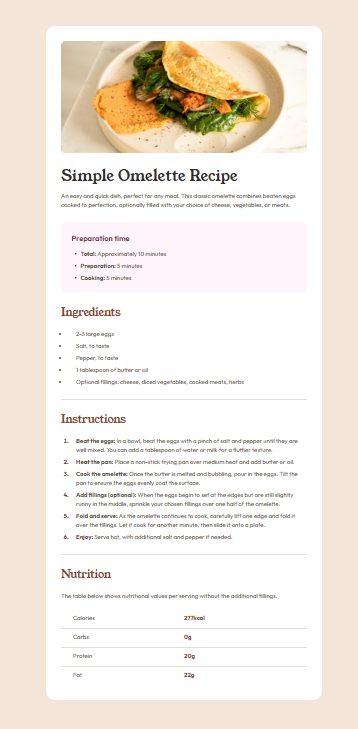

# Recipe-Main-Page
Recipe Main Page | Frontend Mentor

This is a solution to the [Recipe Main Page challenge on Frontend Mentor] (https://www.frontendmentor.io/challenges/recipe-page-KiTsR8QQKm). Frontend Mentor challenges help you improve your coding skills by building realistic projects.

## Table of contents

- [Overview](#overview)
  - [The challenge](#the-challenge)
  - [Screenshot](#screenshot)
  - [Links](#links)
- [My process](#my-process)
  - [Built with](#built-with)
- [Author](#author)

## Overview

### The challenge

### Screenshot

### Links

- Solution URL: [https://github.com/hardaway-2000/Recipe-Main-Page.git](https://github.com/hardaway-2000/Recipe-Main-Page.git)
- Live Site URL: [https://hardaway-2000.github.io/Recipe-Main-Page/](https://hardaway-2000.github.io/Recipe-Main-Page/)

## My process

### Built with

- Semantic HTML5 markup
- Plain CSS
- Flexbox
- Desktop-first workflow

## Author

- Name - Mohamed Alaa
- Frontend Mentor - [@hardaway-2000](https://www.frontendmentor.io/profile/hardaway-2000)
